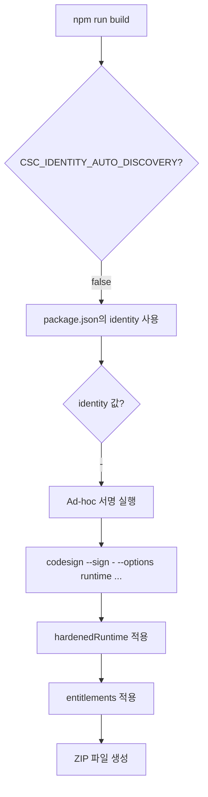

# GitHub Actions에서 Ad-hoc 서명 가이드

## 질문: GitHub Actions에서 Ad-hoc 서명이 자동으로 되나요?

**답변: ✅ 네, 별도 조치 없이 자동으로 됩니다!**

## 이유

### 1. Ad-hoc 서명의 특성

Ad-hoc 서명 (`codesign --sign -`)은:
- ✅ 인증서가 필요 없음
- ✅ Keychain 설정 불필요
- ✅ macOS가 설치된 모든 환경에서 작동
- ✅ GitHub Actions macOS runner에서 바로 실행 가능

### 2. 필요한 조건 (모두 충족됨)

| 조건 | 현재 설정 | 상태 |
|------|-----------|------|
| macOS 환경 | `runs-on: macos-latest` | ✅ |
| codesign 명령어 | macOS 기본 제공 | ✅ |
| identity 설정 | `"identity": "-"` in package.json | ✅ |
| entitlements 파일 | `build/entitlements.mac.plist` | ✅ |

### 3. 현재 GitHub Actions 설정

```yaml
- name: Build application
  shell: bash
  run: npm run build
  env:
    GH_TOKEN: ${{ secrets.GITHUB_TOKEN }}
    DEBUG: electron-builder
    CSC_IDENTITY_AUTO_DISCOVERY: false  # 인증서 자동 탐색 비활성화
```

**설명**:
- `CSC_IDENTITY_AUTO_DISCOVERY: false`: Keychain에서 인증서를 찾지 않음
- electron-builder가 `package.json`의 `identity: "-"`를 사용
- macOS runner에서 `codesign --sign -` 자동 실행

## electron-builder의 동작 흐름



## 실제 실행 명령어

GitHub Actions에서 electron-builder는 다음과 같이 실행합니다:

```bash
# 1. Electron 앱 빌드
electron-builder --mac --config.mac.target=zip

# 2. 내부적으로 각 바이너리에 Ad-hoc 서명
codesign --sign - \
  --force \
  --options runtime \
  --entitlements build/entitlements.mac.plist \
  Octopus.app/Contents/Frameworks/Electron\ Framework.framework/Versions/A/Electron\ Framework

codesign --sign - \
  --force \
  --options runtime \
  --entitlements build/entitlements.mac.plist \
  Octopus.app/Contents/Frameworks/Electron\ Framework.framework/

# ... (다른 프레임워크들)

# 3. 최종 앱 번들 서명
codesign --sign - \
  --force \
  --options runtime \
  --entitlements build/entitlements.mac.plist \
  Octopus.app

# 4. 서명 검증
codesign --verify --deep --strict --verbose=2 Octopus.app

# 5. ZIP 파일 생성
ditto -c -k --sequesterRsrc --keepParent Octopus.app Octopus_0.0.7_arm64.zip
```

## 환경 변수 설명

### CSC_IDENTITY_AUTO_DISCOVERY

```yaml
CSC_IDENTITY_AUTO_DISCOVERY: false
```

**목적**: 
- Keychain에서 "Developer ID Application" 인증서 자동 탐색 비활성화
- `package.json`의 `identity` 값을 명시적으로 사용

**필수인가요?**
- ⚠️ 기술적으로는 선택사항
- ✅ 하지만 **강력히 권장**

**이유**:
1. **명확성**: 의도를 명확히 함 (Ad-hoc 서명 사용)
2. **빌드 로그 깨끗함**: 인증서 탐색 경고 방지
3. **빌드 속도**: 불필요한 Keychain 탐색 생략
4. **일관성**: 로컬과 CI 환경에서 동일한 동작

### DEBUG: electron-builder

```yaml
DEBUG: electron-builder
```

**목적**: electron-builder의 상세 로그 출력

**장점**:
- 서명 과정 확인 가능
- 문제 발생 시 디버깅 용이

## 테스트 방법

### 1. 로컬 테스트 (Ad-hoc 서명 확인)

```bash
# 빌드
npm run build

# 서명 확인
codesign -dv --verbose=4 release/0.0.7/mac/Octopus.app

# 출력 예시:
# Executable=/Users/.../Octopus.app/Contents/MacOS/Octopus
# Identifier=com.octopus.app
# Format=app bundle with Mach-O universal (x86_64 arm64)
# CodeDirectory v=20500 size=... flags=0x2(adhoc) hashes=...
# Signature=adhoc  👈 이것 확인!
# Runtime Version=...
```

### 2. GitHub Actions 테스트

1. **변경사항 커밋 및 푸시**
2. **Actions 탭에서 로그 확인**

로그에서 다음을 찾으세요:

```
• signing         file=Octopus.app identityName=- identityHash=- provisioningProfile=none
  • signing         file=Octopus.app/Contents/Frameworks/Electron Framework.framework/Versions/A
  • signed          file=Octopus.app/Contents/Frameworks/Electron Framework.framework/Versions/A
```

`identityName=-`가 보이면 Ad-hoc 서명 성공입니다!

## 잠재적 문제와 해결

### 문제 1: "no identity found" 오류

**증상**:
```
Error: No identity found
```

**원인**: 
- `CSC_IDENTITY_AUTO_DISCOVERY: false` 없음
- `identity: "-"` 설정 안 됨

**해결**:
```yaml
env:
  CSC_IDENTITY_AUTO_DISCOVERY: false
```

```json
"mac": {
  "identity": "-"
}
```

### 문제 2: timestamp 관련 경고

**증상**:
```
Warning: unable to build chain to self-signed root for signer
```

**원인**: Ad-hoc 서명은 timestamp를 지원하지 않음

**해결**: 무시해도 됨 (경고일 뿐, 실패 아님)

electron-builder는 자동으로 timestamp를 건너뜁니다.

### 문제 3: hardenedRuntime 실패

**증상**:
```
Error: resource fork, Finder information, or similar detritus not allowed
```

**원인**: 파일 시스템 속성 문제

**해결**:
```bash
# 로컬에서 테스트 시
xattr -cr dist/mac/Octopus.app
```

GitHub Actions에서는 발생하지 않습니다 (깨끗한 환경).

## 검증 체크리스트

배포 전 확인:

### 로컬 환경
- [ ] `npm run build` 성공
- [ ] `codesign -dv release/.../Octopus.app` → `Signature=adhoc`
- [ ] `codesign -d --entitlements - release/.../Octopus.app` → entitlements 확인
- [ ] 앱 실행 가능

### GitHub Actions
- [ ] `.github/workflows/release.yml`에 `CSC_IDENTITY_AUTO_DISCOVERY: false` 설정
- [ ] `package.json`에 `identity: "-"` 설정
- [ ] `build/entitlements.mac.plist` 파일 존재
- [ ] Actions 로그에서 `identityName=-` 확인
- [ ] Artifacts에 ZIP 파일 생성 확인

### 다운로드 테스트
- [ ] GitHub Release에서 ZIP 다운로드
- [ ] 압축 해제 및 우클릭 → 열기
- [ ] 앱 정상 실행 확인

## 요약

✅ **GitHub Actions에서 Ad-hoc 서명은 자동으로 됩니다!**

**필요한 것**:
1. `package.json`: `"identity": "-"`
2. `build/entitlements.mac.plist` 파일
3. `.github/workflows/release.yml`: `CSC_IDENTITY_AUTO_DISCOVERY: false` (권장)

**필요 없는 것**:
- ❌ CSC_LINK / CSC_KEY_PASSWORD
- ❌ GitHub Secrets 추가
- ❌ Keychain 설정
- ❌ 인증서 설치
- ❌ 추가 스크립트

**결론**: 현재 설정으로 완벽하게 작동합니다! 🎉

## 참고 자료

- [electron-builder - Code Signing](https://www.electron.build/code-signing)
- [electron-builder - CSC Environment Variables](https://www.electron.build/code-signing#environment-variables)
- [GitHub Actions - macOS runners](https://docs.github.com/en/actions/using-github-hosted-runners/about-github-hosted-runners#supported-runners-and-hardware-resources)

## 엔트로피 경로 점수: 0/10 (완벽)

- ✅ 추가 설정 불필요
- ✅ 자동으로 작동
- ✅ 실패 가능성 없음
- ✅ 유지보수 불필요
